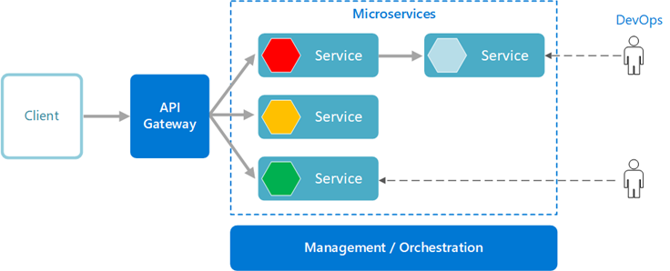
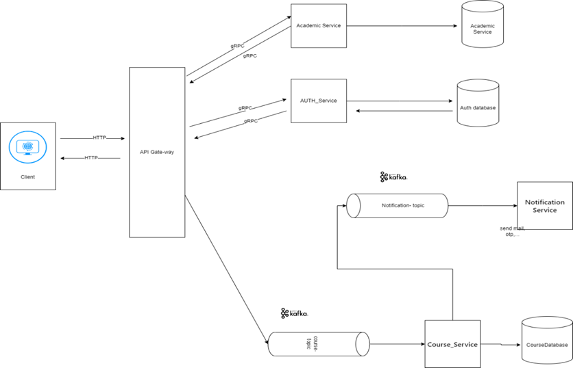

# ĐỒ ÁN MÔN HỌC THIẾT KẾ VÀ KIẾN TRÚC PHẦN MỀM

Đề tài: Hệ thống quản lý lớp học tín chỉ

## 1. Thành viên:

Võ Tấn Đạt - 201160313
Trần Thanh Đại - 20077931

## 2. Phân tích đề bài:

Hệ thống quản lý lớp học tín chỉ bao gồm các chức năng chính như:
Sinh viên đăng kí học phần
Sinh viên xem chương trình khung
Sinh viên xem lịch học
Sinh viên xem điểm
Sinh viên xem tình trạng theo chương trình học tín chỉ của mình(Tín chỉ nào hoàn thành, chưa hoàn thành,...)
Sinh viên xét tốt nghiệp
Giảng viên mở đăng kí mở lớp học
Phòng đào tạo mở đợt đăng kí tín chỉ
Sinh viên thanh toán học phí

# 3. Lựa chọn kiến trúc và hiện thực bài toán

## 3.1 Chọn kiến trúc

Kiến trúc được lựa chọn: Microservice

## 3.2 Lý do chọn kiến trúc

Việc lựa chọn kiến trúc microservice có vài lý do như sau:

Bản thân microservice đã có những lợi điểm khi sử dụng, các ưu điểm nổi bật như sau:

- **Tính mô-đun và linh hoạt**: Với microservices, ta có thể triển khai các dịch vụ riêng lẻ cho từng chức năng (đăng ký học phần, quản lý thông tin sinh viên, xử lý thông báo email, quản lý lớp học, v.v.). Điều này giúp hệ thống dễ dàng mở rộng và bảo trì hơn.
- **Khả năng mở rộng**: Mỗi microservice có thể được mở rộng độc lập dựa trên nhu cầu và tải công việc của nó. Ví dụ, dịch vụ xử lý đăng ký học phần có thể cần mở rộng nhiều hơn vào đầu học kỳ khi sinh viên đăng ký học phần nhiều.
  Khả năng chịu lỗi tốt hơn: Một lỗi trong một microservice sẽ không ảnh hưởng đến toàn bộ hệ thống, giúp đảm bảo sự ổn định và liên tục của dịch vụ.

Tương tác rất tốt với MQ apache Kafka, Kafka thường được sử dụng trong mô hình microservice để cung cấp khả năng xử lý sự kiện và truyền thông không đồng bộ giữa các dịch vụ và sử dụng Kafka đối với yêu cầu bài toán đăng ký học phần theo tín chỉ trên là rất hợp lý:

- **Quản lý đăng ký học phần**: Kafka có thể được sử dụng để xử lý các yêu cầu đăng ký học phần một cách bất đồng bộ. Khi sinh viên gửi yêu cầu đăng ký, yêu cầu này có thể được đưa vào một hàng đợi Kafka để xử lý sau đó. Điều này giúp giảm tải cho hệ thống và cải thiện trải nghiệm người dùng.
- **Gửi thông báo email**: Khi sinh viên đăng ký thành công, một thông điệp có thể được gửi tới Kafka, sau đó một dịch vụ khác chịu trách nhiệm gửi email sẽ đọc thông điệp này và gửi email xác nhận. Điều này giúp tách biệt logic gửi email khỏi quá trình đăng ký, làm hệ thống linh hoạt và dễ bảo trì hơn.

## 3.3 Thiết kế kiến trúc

Chia các service theo thức năng gồm có 7 service chính:

- **AuthService**: Đảm nhiệm chức năng quản lý xác thực và phân quyền người dùng. Nó sẽ xử lý việc đăng nhập, đăng ký, và xác thực người dùng.

- **RegistrationService**: Service này quản lý quá trình đăng ký học phần của sinh viên. Nó sẽ kiểm tra và xác nhận đăng ký, quản lý danh sách dự bị, và gửi thông báo xác nhận cho sinh viên.

- **CourseService**: Service này quản lý thông tin về các môn học, xem chương trình khung, môn tiên quyết, tiến độ học tập(môn học nào đã hoàn thành, chưa hoàn thành)
- **StudentService**: Service này cung cấp các tính năng liên quan đến thông tin học tập của sinh viên như số tín chỉ đã đạt, số môn đã học, điểm số, và thời khóa biểu.

- **GraduationService**: Service này quản lý quá trình đăng ký xét tốt nghiệp và cấp bằng tốt nghiệp cho sinh viên đã đủ điều kiện. Nó cũng quản lý thông tin về cựu sinh viên và công khai thông tin về bằng cấp trên trang web của nhà trường.

- **NotificationService**: Service này chịu trách nhiệm gửi thông báo qua email cho sinh viên sau khi họ đăng ký thành công hoặc khi có các sự kiện quan trọng khác trong hệ thống.

- **AnalysisService**: Service này cung cấp các tính năng để theo dõi và phân tích hoạt động của hệ thống, bao gồm thống kê về số lượng sinh viên đăng ký, tình trạng của các lớp học, và các hoạt động khác

## 3.4 Các vấn đề cần giải quyết trong microservice

## 3.4.1Giao tiếp giữa các service:

Sử dụng Kafka và gRPC để giao tiếp với các service

- **Kafka**: NotificationService, AnalysisService, RegistrationService giao tiếp API Layer bằng Kafka
- **gRPC**: NotificationService, AnalysisService, RegistrationService giao tiếp API Layer bằng gRPC

# 4. Công nghệ sử dụng:

- gRPC(giao tiếp giữa các service)
- NestJS(API-BACKEND)
- ReactJS(Giao diện người dùng)
- MongoDB
- MySQL
- Kafka
- AWS services

# 5. Hướng dẫn cài đặt dự án
